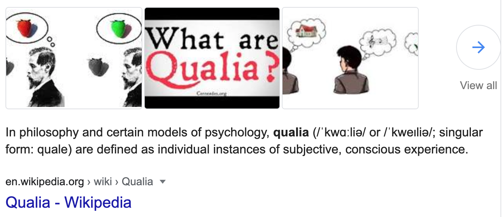

------------------------------------------------------------------------

NoteQualia (cognod.es)
======================

<details>
  <summary>What is Qualia?</summary>
  
</details>


An experimental project with underpinned by ideas from [Evergreen
notes](https://notes.andymatuschak.org/) and [Zettelkasten note-taking
(slip-box)](https://blog.viktomas.com/posts/slip-box/) with
[WriteMapper-like](https://writemapper.com/) experience to visually
navigate note references.

Components in this repo by folder
---------------------------------

-   `frontend` - React App hosted at <https://cognod.es>
-   `desktop-app` - Electron App (just a boilerplate for now, the goal is to run the same code as frontend app here)
-   `iphone-app` - React-Native App
-   `notequalia` - Python Restful API for finding word definitions and
    store notes.
-   `operations` - Full infrastructure-as-code that deploys the project
    to kubernetes in digital ocean.
-   `tests` - unit and functional tests for the python code.

Running locally
---------------

### Frontend: React App

TypeScript + React + Redux + Bootstrap with bootswatch theme.

``` {.sourceCode .bash}
cd ./frontend
npm install
npm start
```

Then open your browser at http://localhost:3000 to browse the live app - changes to code are automatically reflected.

### Frontend: React-Native App

TypeScript + React + Redux + [NativeBase Components](https://docs.nativebase.io/Components.html#Components)

``` {.sourceCode .bash}
cd ./iphone-app
npm install
npm run web
```


Then install [Expo](https://itunes.apple.com/app/apple-store/id982107779) in your iphone and scan the QR Code to run the live app on your phone - changes to code are automatically reflected.

### Backend: Python App

Python + PostgreSQL with migrations

``` {.sourceCode .bash}
make db tests run
```


### Frontend: Desktop App

Electron running the stack of the Frontend React App

``` {.sourceCode .bash}
cd ./desktop-app
npm install
npm start
```
